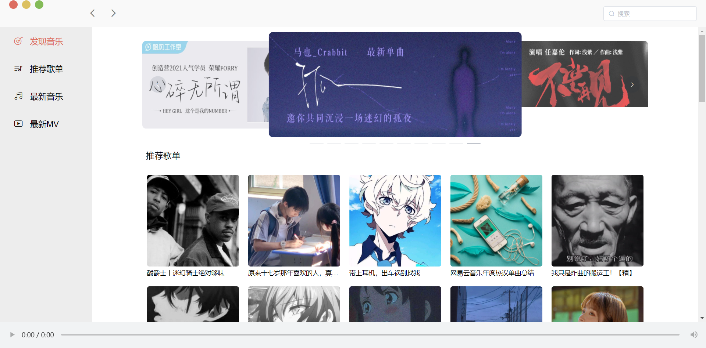
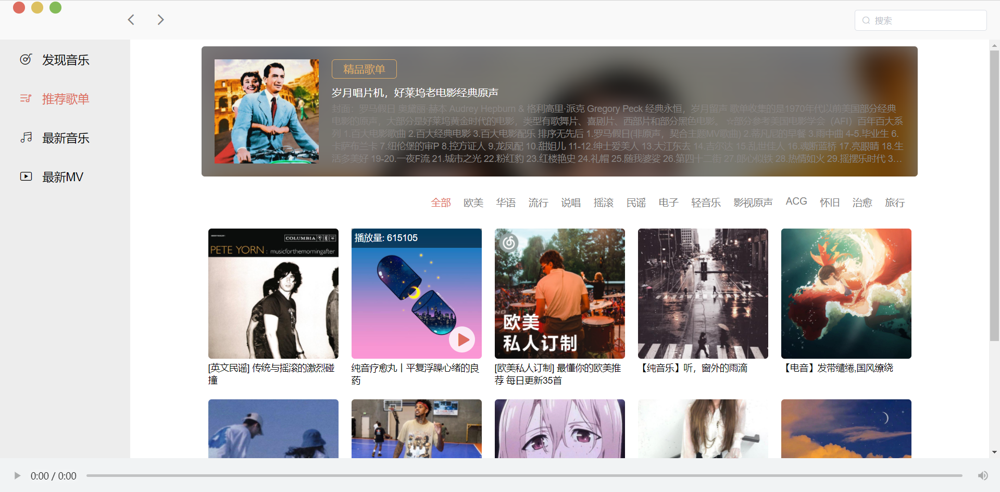
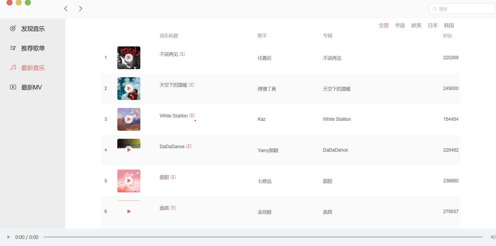
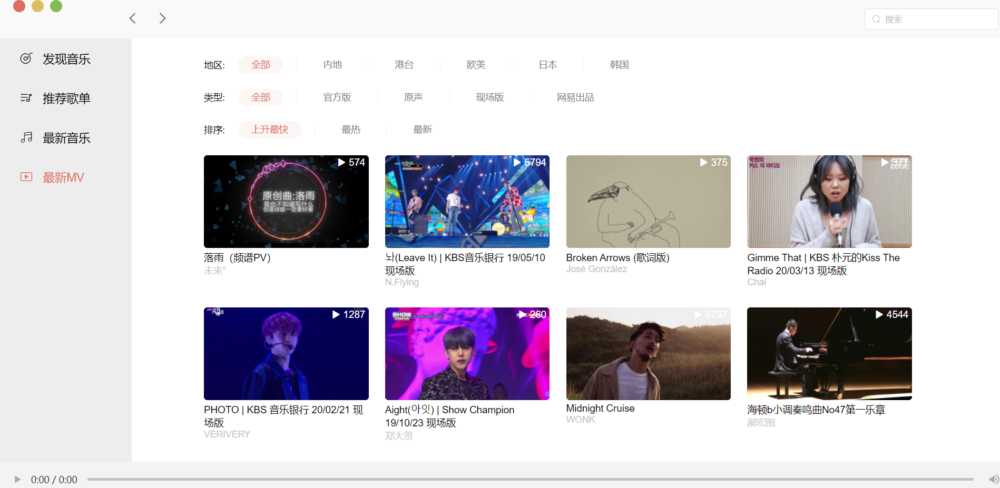

# Vue仿网易云音乐

接口文档：[API接口文档](https://neteasecloudmusicapi.vercel.app/#/?id=neteasecloudmusicapi) 

## 说明

练手小项目。。

## 技术栈
- Vue
- VueRouter
- ElementUi

## 预览截图

### 首页

### 歌单

### 音乐

### mv

## 未完成功能

1.所有的 评论只能看，不能点赞和自己评论
2.云盘
3.歌单的添加/修改
...